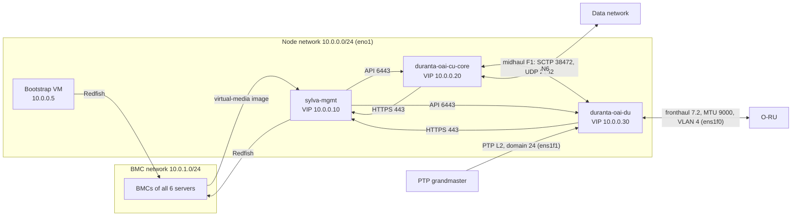
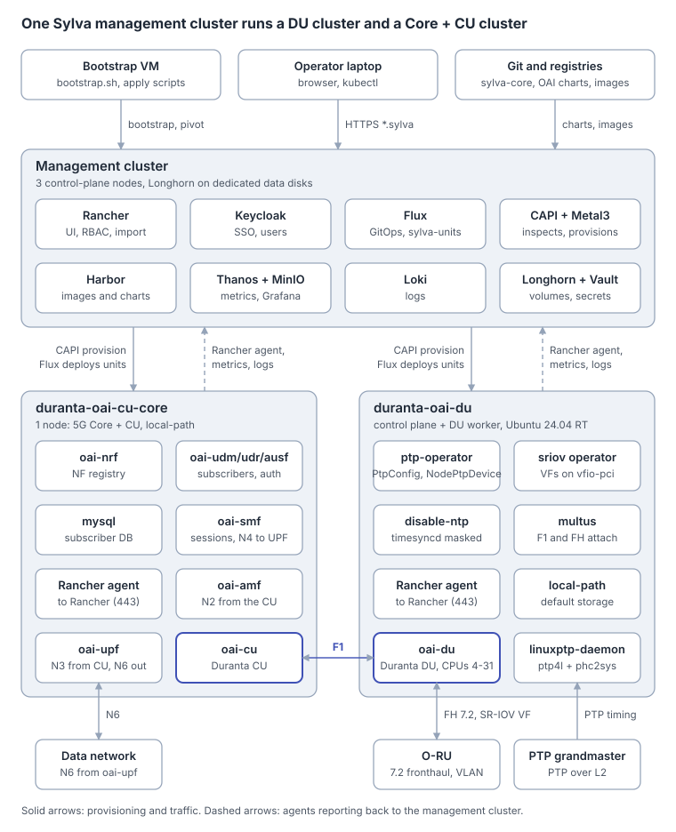

<!-- SPDX-License-Identifier: CC-BY-4.0 -->

<p align="center">
  
</p>

# Sylva for Duranta/OAI: a DU Cluster and a Core + CU Cluster

> **Versions.** Written for and validated against **Sylva 1.7.6** (`sylva-core` tag `1.7.6`). Other Sylva versions may use different value names or OS image labels: run `./validate.sh` against your version before deploying (see [Validate before you deploy](#validate-before-you-deploy)).
>
> | Component | Version |
> | --- | --- |
> | sylva-core | `1.7.6` (sylva-capi-cluster `0.14.33`, diskimage-builder `0.11.13`) |
> | Kubernetes | `v1.35.6+rke2r1` (Sylva 1.7.6 default) |
> | Node OS image | `ubuntu-noble-hardened-rke2-1-35` (Ubuntu 24.04, labelled `os-release: noble`) |
> | Real-time kernel | `linux-realtime` `6.8.1-1015.16` (Ubuntu 24.04 `universe`) |
> | ptp-operator | k8snetworkplumbingwg `main` @ `4c9223a` (2026-10-01), image `ghcr.io/k8snetworkplumbingwg/ptp-operator@sha256:90fdd78c…` |
> | linuxptp-daemon | k8snetworkplumbingwg `main` @ `288f5c7` (2026-09-30), image `ghcr.io/k8snetworkplumbingwg/linuxptp-daemon@sha256:23c70f68…` |
> | sriov-network-operator CRDs | k8snetworkplumbingwg `main` @ `38898df` (2026-09-29) |

Read online: **https://openairinterface.github.io/duranta-oai-sylva-deployment/**

This tutorial builds a split Duranta/OAI 5G network on bare metal with Sylva. One 3-node management cluster creates two workload clusters: a real-time **DU cluster** with an O-RAN 7.2 fronthaul, and a **Core + CU cluster** running the OAI 5G Core and the CU. All clusters run RKE2 on Ubuntu 24.04, and Sylva provisions the servers through their BMCs with Metal3.

## Overview

| Cluster | Folder | Nodes | Runs |
| --- | --- | --- | --- |
| Management | `sylva-mgmt` | 3 control-plane | Sylva, Rancher, Keycloak, Flux, Cluster API + Metal3, Harbor, monitoring |
| Core + CU | `duranta-oai-cu-core` | 1 | OAI 5G Core (AMF, SMF, UPF, NRF, UDM…) and the Duranta/OAI CU |
| DU | `duranta-oai-du` | 1 control-plane + 1 DU worker | Duranta/OAI DU with a real-time kernel, SR-IOV, PTP |

**You need:**

- An Ubuntu bootstrap VM (4 vCPU, 8 GB RAM, Docker) that can reach every BMC and the node network.
- BMC address, credentials and MAC addresses for every server. MACs are shown in the BIOS or the BMC web UI.
- On the DU server: hyper-threading disabled and the BIOS performance profile selected (not the telco profile).
- A PTP grandmaster and an O-RU on the fronthaul network.
- The networks below, cabled and switched before you start.

## Network requirements

Six networks are involved. The addresses are this guide's examples; replace them with your own plan.

| Network | Example | Who is on it | Must allow |
| --- | --- | --- | --- |
| BMC (out-of-band) | `10.0.1.0/24` | The BMC of every server: 3 management, 1 Core + CU, 2 DU | Bootstrap VM and management nodes → BMCs over Redfish (HTTPS). BMCs → bootstrap VM (`10.0.0.5`) during bootstrap, then → management VIP (`10.0.0.10`), to download the virtual-media boot image from Metal3/Ironic. |
| Node (management) | `10.0.0.0/24`, port `eno1` | Bootstrap VM, every node, the three cluster VIPs (`.10`, `.20`, `.30`) | Workload nodes → management VIP on HTTPS 443 (Rancher, Keycloak, Harbor, Thanos, Loki) and to Ironic during inspection and provisioning. Management cluster → each workload API VIP on 6443 (Cluster API, Flux). All nodes → container registries and the Ubuntu archive, directly or through a proxy or mirror. |
| Midhaul (F1) | `10.0.0.120` (CU) ↔ `10.0.0.130` (DU) | CU pod on the Core + CU node, DU pod on the DU node | SCTP 38472 (F1-C) and UDP 2152 (F1-U, GTP-U) between the two clusters, without NAT. |
| Fronthaul (O-RAN 7.2) | VLAN 4, port `ens1f0` | DU node and O-RU | Layer 2 only: eCPRI/C-U-plane frames on the fronthaul VLAN, the MTU your O-RU requires. MTU 9K |
| PTP | port `ens1f1` | DU node and the PTP grandmaster (or a PTP-aware switch) | PTP over Ethernet (L2 multicast), domain 24. Switches in the path must be PTP-aware (boundary or transparent clock). |
| Data network (N6) | site-specific | UPF on the Core + CU node | Routed access to the data network or the internet. |



Notes:

- In this guide the midhaul rides the node network through Multus macvlan on `eno1`. In production, give F1 its own VLAN or port: change `"master"` in both `f1-macvlan-*.yaml` files and add that interface to each cluster's `network_interfaces`.
- Some O-RAN 7.2 setups carry PTP and fronthaul on the same port (for example, a switch that is both the PTP boundary clock and the fronthaul switch). In that case use the fronthaul port name in the PtpConfig as well.
- If the BMC and node networks are routed rather than bridged, the routes must exist in both directions: BMCs → management VIP, and management nodes → BMCs.

**Ubuntu version:** Sylva ships Ubuntu 24.04 node images, and the **hardened** RKE2 variant. Sylva labels them `os-release: noble` (not `24.04`), so the selectors in this guide use `noble`. Node bootstrap depends on Sylva scripts and RKE2 binaries baked into those images. To use another OS, build your own image with Sylva's diskimage-builder and set `machine_image_url`.

**Files.** Every YAML is a separate file. Copy `environment-values/` into `sylva-core/environment-values/`; the files under `manifests/` are applied later to the matching workload cluster.

```
oai-sylva-guide/
├── README.md                            this tutorial
├── validate.sh                          offline check of all files against a sylva-core checkout
├── mkdocs.yml, docs.sh                  GitHub Pages site: MkDocs Material theme, built from this README
├── assets/architecture.svg              cluster and pod diagram used in this README
├── docs-requirements.txt                pinned MkDocs versions for the site
├── .gitignore                           keeps clones and kubeconfigs out of git
├── .github/workflows/pages.yml          validates on every push, publishes to GitHub Pages
├── environment-values/
│   ├── sylva-mgmt/                      kustomization.yaml, values.yaml, secrets.yaml
│   └── workload-clusters/
│       ├── duranta-oai-cu-core/         kustomization.yaml, values.yaml, secrets.yaml
│       └── duranta-oai-du/              kustomization.yaml, values.yaml, secrets.yaml
└── manifests/
    ├── duranta-oai-cu-core/
    │   └── f1-macvlan-cu.yaml
    └── duranta-oai-du/
        ├── f1-macvlan-du.yaml
        ├── sriovnetwork-oai-fh.yaml
        ├── ptp-operator/                kustomization.yaml, upstream-ptp-operator.yaml, certificates.yaml
        ├── ptp-operator-config.yaml
        ├── ptpconfig-oai-du.yaml
        └── disable-ntp-daemonset.yaml
```

Replace every value marked `CHANGE_ME` (IPs, MACs, BMC addresses, interface names) with your own.

<p align="center">
  
</p>

The management cluster inspects and provisions both workload clusters and deploys their add-ons. Each workload cluster reports back through its Rancher agent. The CU and DU sit in different clusters and connect over F1, the CU reaches the core over N2/N3 inside its cluster, and the DU's timing comes from the PTP grandmaster, not NTP.

## 1. Management cluster (3 nodes)

The management cluster has three control-plane nodes and no workers (`control_plane_replicas: 3`, `machine_deployments: {}`). On RKE2, control-plane nodes also run Sylva's own services.

`environment-values/sylva-mgmt/values.yaml` (excerpt):

```yaml
cluster_virtual_ip: 10.0.0.10            # API and ingress VIP, outside the node IP range
cluster:
  capi_providers: {infra_provider: capm3, bootstrap_provider: cabpr}
  control_plane_replicas: 3
  machine_deployments: {}
  capm3:
    os_image_selector: {os: ubuntu, os-release: noble, hardened: true}
    networks:
      primary: {subnet: 10.0.0.0/24, gateway: 10.0.0.1, start: 10.0.0.11, end: 10.0.0.13}
  baremetal_hosts:                        # mgmt-1, mgmt-2, mgmt-3
    mgmt-1:
      longhorn_disk_config:               # dedicated data disk, not the OS disk
        - {path: /var/longhorn/disks/sdb, storageReserved: 0, allowScheduling: true}
      bmh_metadata: {labels: {cluster-role: control-plane}}
      bmh_spec:
        bmc: {address: redfish-virtualmedia://10.0.1.11/redfish/v1/Systems/1}
        bootMACAddress: aa:bb:cc:00:00:11
metal3:
  bootstrap_ip: 10.0.0.5                  # bootstrap VM IP
```

Put the BMC usernames and passwords in `sylva-mgmt/secrets.yaml`, one entry per host. Then deploy from the bootstrap VM:

```bash
git clone --branch 1.7.6 https://gitlab.com/sylva-projects/sylva-core.git && cd sylva-core
cp -r ../oai-sylva-guide/environment-values/* environment-values/
./bootstrap.sh environment-values/sylva-mgmt
export KUBECONFIG=$PWD/management-cluster-kubeconfig
kubectl get nodes                         # 3 Ready control-plane nodes
```

### Storage

Harbor, Thanos/MinIO (metrics and Grafana), Loki, Keycloak's PostgreSQL and Vault/OpenBao all need persistent volumes. NFS is not needed.

On bare metal, Sylva enables **Longhorn** automatically and makes it the default StorageClass. Longhorn replicates each volume across the three nodes, so each node needs one dedicated data disk (960 GB SSD recommended), declared with `longhorn_disk_config` as above. After bootstrap, `kubectl get sc` should show `longhorn (default)`, and `kubectl get pvc -A` should show every claim `Bound`.

Enable `units.nfs-ganesha` only if an application needs ReadWriteMany volumes. The single-node workload clusters set `units.longhorn.enabled: false`, so `local-path` becomes their default StorageClass.

### Access Rancher and create users

Point the Sylva hostnames at the management VIP on the machine you browse from:

```bash
echo "10.0.0.10 rancher.sylva keycloak.sylva vault.sylva flux.sylva harbor.sylva thanos.sylva" | sudo tee -a /etc/hosts
```

Open `https://rancher.sylva`, choose **Log in with Keycloak** and sign in as `sylva-admin`. The certificate is issued by Sylva's internal CA; accept it, or import the CA into your browser.

| Account | Password |
| --- | --- |
| `sylva-admin` (SSO, Keycloak realm `sylva`) | `kubectl -n sylva-system get secret sylva-units-values -o template='{{ .data.values }}' \| base64 -d \| grep admin_password` |
| `admin` (local Rancher, break-glass) | `kubectl -n cattle-system get secret bootstrap-secret -o go-template='{{.data.bootstrapPassword\|base64decode}}{{"\n"}}'` |
| Keycloak admin (admin console) | `kubectl -n keycloak get secret keycloak-bootstrap-admin -o go-template='{{.data.username\|base64decode}} {{.data.password\|base64decode}}'` |

Sylva generates the `sylva-admin` password at bootstrap. Outside production you can choose it with `admin_password:` in `sylva-mgmt/secrets.yaml`.

To add a user:

1. Open `https://keycloak.sylva/admin/master/console`, log in as the Keycloak admin and switch to realm **sylva**.
2. Go to **Users → Add user**, then **Credentials → Set password**, and add the user to a group such as `oai-admins`.
3. Give the group a Rancher role, either under **Users & Authentication → Groups** in Rancher or with this manifest:

```yaml
apiVersion: management.cattle.io/v3
kind: GlobalRoleBinding
metadata:
  name: grb-oai-admins
globalRoleName: admin                     # or user, restricted-admin
groupPrincipalName: keycloakoidc_group://oai-admins
```

To manage users from Git instead, declare them under `keycloak.user_management` in `sylva-mgmt/values.yaml` (see the Sylva user-management docs).

## 2. Core + CU cluster

The OAI 5G Core and the Duranta/OAI CU share one Ubuntu 24.04 node. Neither needs real-time tuning. Multus gives pods extra interfaces for F1 (towards the DU) and N3/N6 (UPF).

`environment-values/workload-clusters/duranta-oai-cu-core/values.yaml` (excerpt):

```yaml
cluster_virtual_ip: 10.0.0.20
units:
  multus:
    enabled: true                         # extra pod interfaces: F1 (CU-DU), N3/N6 (UPF)
  longhorn:
    enabled: false                        # single node: local-path is the default StorageClass
cluster:
  capi_providers: {infra_provider: capm3, bootstrap_provider: cabpr}
  control_plane_replicas: 1
  machine_deployments: {}
  capm3:
    os_image_selector: {os: ubuntu, os-release: noble, hardened: true}
  baremetal_hosts:
    core-1:
      bmh_metadata: {labels: {cluster-role: core}}
      bmh_spec:
        bmc: {address: redfish-virtualmedia://10.0.1.21/redfish/v1/Systems/1}
        bootMACAddress: aa:bb:cc:00:00:21
```

Deploy it from the bootstrap VM, still using the management kubeconfig:

```bash
./apply-workload-cluster.sh environment-values/workload-clusters/duranta-oai-cu-core
```

Sylva creates the cluster in namespace `duranta-oai-cu-core` (the folder name) and imports it into Rancher automatically. Download its kubeconfig from Rancher (**Cluster → Download KubeConfig**), or list the secret with `kubectl -n duranta-oai-cu-core get secret | grep kubeconfig`.

## 3. Find interface names when you only know the MAC

Before the OS is installed you usually know a port's MAC address (from the BIOS, the BMC or the NIC label), but not the name Linux will give it (`ens1f1`, `enp81s0f1`…). The DU needs three ports identified: the node network, the fronthaul port and the PTP port. Sylva and Metal3 bridge MAC and name in three steps.

**Step 1: pin ports by MAC in Sylva.** In `duranta-oai-du/values.yaml`, `interface_mappings` ties each name used in `network_interfaces` to a MAC. Sylva then configures the node network by MAC, so a wrong guess at the name cannot break provisioning:

```yaml
cluster:
  baremetal_hosts:
    du-1:
      interface_mappings:
        eno1:   {mac_address: "aa:bb:cc:00:00:32"}   # node network
        ens1f0: {mac_address: "aa:bb:cc:00:01:00"}   # fronthaul
        ens1f1: {mac_address: "aa:bb:cc:00:01:01"}   # PTP
```

**Step 2: read the names Metal3 discovered.** As soon as the DU cluster is applied (section 5), Metal3 boots each server into a small inspection image and records every NIC before installing the OS. On the management cluster:

```bash
kubectl -n duranta-oai-du get bmh du-1 -o jsonpath='{range .status.hardware.nics[*]}{.name}{"\t"}{.mac}{"\t"}{.pciAddress}{"\t"}{.speedGbps}{"\n"}{end}'
```

Example output:

```
eno1     aa:bb:cc:00:00:32   0000:01:00.0   1
ens1f0   aa:bb:cc:00:01:00   0000:51:00.0   25
ens1f1   aa:bb:cc:00:01:01   0000:51:00.1   25
```

Find your MACs in the list and note the names. Use the fronthaul name in `sriov.node_policies.oai-fh.nicSelector.pfNames`. Alternatively, use `rootDevices: ["0000:51:00.0"]`; a PCI address does not depend on interface naming. If you change the SR-IOV policy, re-run `apply-workload-cluster.sh`; the node is not reinstalled.

**Step 3: confirm the PTP port on the running node.** The inspection image and Ubuntu normally produce the same predictable names, but always check before writing the PtpConfig. Once the PTP operator is installed (section 6), it lists every PTP-capable port on each node:

```bash
kubectl -n openshift-ptp get nodeptpdevices -o jsonpath='{range .items[*]}{.metadata.name}{": "}{range .status.devices[*]}{.name}{" "}{end}{"\n"}{end}'
```

On the DU node itself, map the MAC to a name and check that the port has a hardware clock:

```bash
ip -br link | grep -i aa:bb:cc:00:01:01      # prints the interface name, e.g. ens1f1
ethtool -T ens1f1                            # needs "PTP Hardware Clock: <n>" and hardware-transmit/receive
```

Use that name in **both** places in `ptpconfig-oai-du.yaml`: the profile's `interface:` and the `[ens1f1]` section header of `ptp4lConf`.

## 4. DU cluster: node tuning

The DU worker uses a Sylva **node class** (`ran-du`) that applies the server settings from the [OAI FHI 7.2 tutorial](https://github.com/duranta-project/openairinterface5g/blob/develop/doc/ORAN_FHI7.2_Tutorial.md#configure-your-server) while the node is provisioned. The example assumes a 32-core server with hyper-threading disabled in the BIOS: CPUs 0–3 run the OS, IRQs and kubelet, and CPUs 4–31 are isolated for the DU. Adjust the CPU ranges and hugepage count to your server.

| OAI setting | Where it goes in Sylva |
| --- | --- |
| `isolcpus=domain,4-31 nohz_full=4-31 rcu_nocbs=4-31 irqaffinity=0,1,2,3` | `kernel_cmdline.extra_options` |
| `intel_iommu=on iommu=pt intel_pstate=disable` | `kernel_cmdline.extra_options` (`amd_iommu=on` on AMD) |
| `default_hugepagesz=1G hugepagesz=1G hugepages=20`, 2M = 0 | `kernel_cmdline.hugepages` |
| `cpupower idle-set -D 0` | `processor.max_cstate=1 intel_idle.max_cstate=0` in `extra_options` (persists across reboots) |
| `/etc/sysctl.d/rt.conf` | `additional_commands.pre_bootstrap_commands` |
| SR-IOV VFs bound to `vfio-pci` | `sriov.node_policies` + `SriovNetwork` |
| Hyper-threading off, performance profile | BIOS |

`selinux=0 enforcing=0` is not needed on Ubuntu, which uses AppArmor. Sylva writes the kernel arguments to GRUB and reboots the node once before RKE2 starts.

`environment-values/workload-clusters/duranta-oai-du/values.yaml` (node class excerpt):

```yaml
cluster:
  node_classes:
    ran-du:
      non_hugepages_minimum_memory_gb: 16
      kernel_cmdline:
        hugepages: {enabled: true, hugepagesz_2M: 0, hugepagesz_1G: 20, default_size: 1G}
        extra_options: >-
          isolcpus=domain,4-31 nohz_full=4-31 rcu_nocbs=4-31 irqaffinity=0,1,2,3
          intel_iommu=on iommu=pt intel_pstate=disable
          processor.max_cstate=1 intel_idle.max_cstate=0
      kubelet_extra_args: {}              # required by the node class schema, even when empty
      kubelet_config_file_options:
        cpuManagerPolicy: static          # DU pods get exclusive CPUs from 4-31
        reservedSystemCPUs: "0-3"
        topologyManagerPolicy: single-numa-node
        topologyManagerScope: pod
      nodeTaints: {}                      # required, even when empty
      nodeLabels:
        oai.ran/du: "true"
      nodeAnnotations: {}                 # required, even when empty
      additional_commands:
        pre_bootstrap_commands:
          - printf 'kernel.sched_rt_runtime_us=-1\nkernel.timer_migration=0\n' > /etc/sysctl.d/rt.conf && sysctl --system
  machine_deployments:
    du:
      replicas: 1
      node_class: ran-du
      capm3:
        hostSelector: {matchLabels: {cluster-role: du}}

sriov:
  node_policies:
    oai-fh:
      resourceName: oai_fh
      numVfs: 2
      deviceType: vfio-pci
      nodeSelector: {oai.ran/du: "true"}
      nicSelector: {pfNames: [ens1f0]}    # fronthaul port name from section 3
```

`manifests/duranta-oai-du/sriovnetwork-oai-fh.yaml` applies the tutorial's VF options (VLAN, `spoofchk off`, `trust on`). Set each VF's MAC in the DU pod's network annotation so that it matches the O-RU configuration.

```yaml
apiVersion: sriovnetwork.openshift.io/v1
kind: SriovNetwork
metadata:
  name: oai-fh
  namespace: cattle-sriov-system
spec:
  resourceName: oai_fh
  networkNamespace: oai
  vlan: 4                                 # fronthaul VLAN
  spoofChk: "off"
  trust: "on"
  ipam: "{}"
```

## 5. DU cluster: real-time kernel and deployment

The DU node runs Sylva's hardened Ubuntu 24.04 image (the only Ubuntu RKE2 image Sylva publishes) and installs [linux-realtime](https://launchpad.net/ubuntu/+source/linux-realtime) from the 24.04 `universe` archive. This second entry in the node class's `pre_bootstrap_commands` installs the kernel, makes it the GRUB default and reboots once. Cloud-init then runs again, finds the RT kernel and skips the block.

```yaml
cluster:
  capm3:
    os_image_selector: {os: ubuntu, os-release: noble, hardened: true}
  node_classes:
    ran-du:
      additional_commands:
        pre_bootstrap_commands:
          - |
            if ! uname -r | grep -q realtime; then
              apt-get update
              DEBIAN_FRONTEND=noninteractive apt-get install -y linux-realtime
              KVER=$(ls /boot/vmlinuz-*realtime | sort -V | tail -1 | sed 's|/boot/vmlinuz-||')
              sed -i "s|^GRUB_DEFAULT=.*|GRUB_DEFAULT=\"Advanced options for Ubuntu>Ubuntu, with Linux ${KVER}\"|" /etc/default/grub
              update-grub
              cloud-init clean --reboot
              sleep 86400
            fi
```

The install commands were tested on a stock Ubuntu 24.04 userland: `linux-realtime` resolves from `universe` and the `GRUB_DEFAULT` line is written correctly. They have not yet been run on Sylva's hardened image; if its hardening blocks apt or `universe`, install the kernel while building your own image instead.

The RT kernel boots with the node class kernel arguments, because Sylva writes them to `/etc/default/grub` before this step. The DU node therefore reboots twice: once for the kernel arguments and once for the RT kernel.

Deploy the DU cluster:

```bash
./apply-workload-cluster.sh environment-values/workload-clusters/duranta-oai-du
```

While the servers are being inspected, run the step 2 command from section 3 to read the interface names. When the cluster is ready, download its kubeconfig from Rancher as `duranta-oai-du-kubeconfig`.

## 6. DU cluster: PTP and NTP

The [ptp-operator](https://github.com/k8snetworkplumbingwg/ptp-operator/tree/main) runs linuxptp (ptp4l and phc2sys) on the DU node, locked to the PTP grandmaster. A privileged DaemonSet turns off host NTP so that only phc2sys sets the system clock. Sylva's own NTP setting is already off (`ntp.enabled: false` in `duranta-oai-du/values.yaml`).

Install the operator against the DU cluster. It runs in namespace `openshift-ptp`:

```bash
export KUBECONFIG=$PWD/duranta-oai-du-kubeconfig
kubectl apply -k oai-sylva-guide/manifests/duranta-oai-du/ptp-operator
kubectl -n openshift-ptp rollout status deploy/ptp-operator
```

The ptp-operator is written for OpenShift. Its upstream install (`make deploy`) does not start on plain Kubernetes such as RKE2, so `manifests/duranta-oai-du/ptp-operator/` wraps it in a small kustomize overlay:

| File | Content |
| --- | --- |
| `upstream-ptp-operator.yaml` | Upstream manifests, unmodified, rendered with `FREE_RUN=1 make deploy` from commit `4c9223a` |
| `certificates.yaml` | cert-manager certificates for the webhook (`webhook-server-cert`) and the daemon metrics endpoint (`linuxptp-daemon-secret`). On OpenShift the service-ca operator creates these; Sylva deploys cert-manager on every workload cluster. |
| `kustomization.yaml` | Removes the operator's `node-role.kubernetes.io/master=""` node selector (RKE2 does not set that label value); pins the operator and linuxptp-daemon images by digest, because the tags upstream references (`ptp-operator:5.0`, `origin-ptp:5.0`) are not published; lets cert-manager inject the webhook CA |

To move to a newer ptp-operator, re-render `upstream-ptp-operator.yaml` from that commit, update the two image digests in `kustomization.yaml`, and re-run `KIND=1 ./validate.sh`.

`manifests/duranta-oai-du/ptp-operator-config.yaml` runs the daemon on DU nodes only. RKE2 workers have no `node-role.kubernetes.io/worker` label, so the default selector would match nothing.

```yaml
apiVersion: ptp.openshift.io/v1
kind: PtpOperatorConfig
metadata:
  name: default
  namespace: openshift-ptp
spec:
  daemonNodeSelector:
    oai.ran/du: "true"
```

Apply it, then find the PTP port name with step 3 of section 3 (`nodeptpdevices`, `ip -br link`, `ethtool -T`). `manifests/duranta-oai-du/ptpconfig-oai-du.yaml` is an ordinary clock (client only) with the OAI tutorial's `ptp4l.conf` and phc2sys options. Replace `ens1f1` in both places with your port name:

```yaml
apiVersion: ptp.openshift.io/v1
kind: PtpConfig
metadata:
  name: duranta-oai-du-oc
  namespace: openshift-ptp
spec:
  profile:
    - name: duranta-oai-du
      interface: ens1f1                   # PTP port name (1 of 2)
      ptp4lOpts: "-2"
      phc2sysOpts: "-a -r -r -n 24 -m -R 8"
      ptpSchedulingPolicy: SCHED_FIFO
      ptpSchedulingPriority: 10
      ptp4lConf: |
        [global]
        domainNumber            24
        clientOnly              1
        time_stamping           hardware
        tx_timestamp_timeout    50
        logging_level           6
        summary_interval        0

        [ens1f1]
        network_transport       L2
        hybrid_e2e              0
  recommend:
    - profile: duranta-oai-du
      priority: 4
      match:
        - nodeLabel: oai.ran/du
```

The `[ens1f1]` header (2 of 2) tells ptp4l which port the settings below it apply to, so it must be the same name as `interface:`.

`manifests/duranta-oai-du/disable-ntp-daemonset.yaml` enters the host namespaces, then disables and masks timesyncd, chrony and ntp:

```yaml
apiVersion: v1
kind: Namespace
metadata:
  name: oai-host-config
  labels:
    pod-security.kubernetes.io/enforce: privileged
---
apiVersion: apps/v1
kind: DaemonSet
metadata:
  name: disable-ntp
  namespace: oai-host-config
spec:
  selector:
    matchLabels: {app: disable-ntp}
  template:
    metadata:
      labels: {app: disable-ntp}
    spec:
      nodeSelector:
        oai.ran/du: "true"
      hostPID: true
      tolerations:
        - operator: Exists
      containers:
        - name: disable-ntp
          image: ubuntu:24.04
          securityContext:
            privileged: true
          command: ["/bin/sh", "-c"]
          args:
            - |
              nsenter -t 1 -m -u -i -n -p -- sh -c '
                timedatectl set-ntp false
                for s in systemd-timesyncd chrony chronyd ntp; do
                  systemctl disable --now $s 2>/dev/null || true
                  systemctl mask $s 2>/dev/null || true
                done
                timedatectl | grep -i "NTP service"'
              sleep infinity
          resources:
            requests: {cpu: 10m, memory: 16Mi}
```

Apply the DU manifests:

```bash
kubectl create namespace oai
kubectl apply -f oai-sylva-guide/manifests/duranta-oai-du/
```
## 7. Verify the DU node

Run these on the DU node (SSH as `sylva-user`), or open a shell with `kubectl debug node/<du-node> -it --image=ubuntu` and `chroot /host`:

| Check | Command | Expected |
| --- | --- | --- |
| RT kernel | `uname -r; cat /sys/kernel/realtime` | `*-realtime`, `1` |
| Kernel args | `cat /proc/cmdline` | `isolcpus=domain,4-31 … hugepages=20` |
| Isolated CPUs | `cat /sys/devices/system/cpu/isolated` | `4-31` |
| Hugepages | `grep Huge /proc/meminfo` | `HugePages_Total: 20`, `Hugepagesize: 1048576 kB` |
| RT sysctl | `sysctl kernel.sched_rt_runtime_us` | `-1` |
| SR-IOV | `kubectl get node <du-node> -o jsonpath='{.status.allocatable}'` | a resource ending in `oai_fh` with value `2` |
| PTP port | `ethtool -T <ptp-port>` | `PTP Hardware Clock` present |
| PTP lock | `kubectl -n openshift-ptp logs ds/linuxptp-daemon -c linuxptp-daemon-container \| grep -E 'ptp4l\|phc2sys'` | small master offset, servo state s2 |
| NTP off | `timedatectl` | `NTP service: inactive` |
| F1 up | DU and CU pod logs | F1 Setup Response received by the DU |

## 8. Deploy the workloads with Flux (TODO)

> **TODO:** this section is not written yet. The concrete Flux definitions for the three workloads will be added in a later revision of this guide.

The network functions will be deployed with **Flux**, the GitOps engine Sylva already runs on the management cluster, not by hand with `helm install`:

| Workload | Cluster | Status |
| --- | --- | --- |
| OAI 5G Core (AMF, SMF, UPF, NRF, UDM/UDR/AUSF, MySQL) | `duranta-oai-cu-core` | TODO |
| Duranta/OAI CU | `duranta-oai-cu-core` | TODO |
| Duranta/OAI DU | `duranta-oai-du` | TODO |

Planned approach: Sylva unit or Flux Gitops

## Validate before you deploy

### What `validate.sh` is for

`validate.sh` checks **this guide's own files**, the YAML under `environment-values/` and `manifests/`, against one Sylva release, before you power on any server. It is not a general Helm chart linter and does not validate other projects' charts.

A Sylva deployment takes hours, and a mistake in a values file usually only surfaces deep into provisioning, for example a node that never boots because its OS image selector matches nothing. `validate.sh` catches that class of mistake in a few minutes on a laptop. While this guide was written it found three such bugs, all now fixed: an `os-release` label that matched no image, a non-hardened image variant that Sylva does not publish, and node class fields the schema requires.

Run it whenever:

- you edit the values for your own site (IPs, MACs, hosts, CPU ranges, node class), or
- you move to another Sylva release: check out that tag and run it again. If it fails, the error names the field to fix. Then update the version table at the top.

### How it works

It does what Sylva and Flux would do at deploy time, but only up to rendering the final Kubernetes objects; nothing is applied to real infrastructure.

| Step | What it runs | What it catches |
| --- | --- | --- |
| 1 | Renders Sylva's `sylva-units` chart with `sylva-mgmt` values | Unknown, misspelled or missing keys (the chart has a strict schema) |
| 2 | Renders `sylva-units` for `duranta-oai-cu-core` and `duranta-oai-du`, with the management state Sylva passes to workload clusters | The same, for the workload clusters |
| 3 | Renders `sylva-capi-cluster` at the version the release pins, with the labels of Sylva's real published OS images | Node class, `interface_mappings` and bare-metal host errors; OS image selectors that match nothing. Prints the DU kernel arguments and MAC-pinned ports, and confirms the RT kernel step |
| 4 (`KIND=1` only) | `kubectl apply --dry-run=server --validate=strict` of `manifests/` and the ptp-operator overlay in a temporary kind cluster with the ptp-operator, cert-manager, SR-IOV and Multus CRDs | Wrong field names or types in the PTP, SR-IOV, NTP and F1 manifests |

It cannot test anything that needs the hardware: RT kernel boot, interface names, SR-IOV VFs, PTP lock and F1. Section 7 covers those, on the real DU node.

### Run it

| Mode | Install first | Tested with |
| --- | --- | --- |
| Default: steps 1 to 3 | bash, git, [helm](https://helm.sh/docs/intro/install/) 3 or 4, python3 3.8+ with PyYAML (`apt install python3-yaml`) | helm v3.19.0 and v4.0.4, Python 3.10, PyYAML 6.0.1 |
| `KIND=1`: adds step 4 | the above, plus [docker](https://docs.docker.com/engine/install/) (daemon running), [kind](https://kind.sigs.k8s.io/docs/user/quick-start/), [kubectl](https://kubernetes.io/docs/tasks/tools/) | docker 29.8.1, kind v0.29.0, kubectl v1.35.1 |

The default mode needs no Docker, kind or Kubernetes cluster, only internet access to `gitlab.com` and `registry.gitlab.com`. `KIND=1` also downloads from `github.com` and `docker.io`.

```bash
git clone --branch 1.7.6 https://gitlab.com/sylva-projects/sylva-core.git
./validate.sh sylva-core             # steps 1-3
KIND=1 ./validate.sh sylva-core      # steps 1-4
./validate.sh --help                 # full description
```

Success ends with `All checks passed.` A failure stops at the first problem and prints the Helm or kubectl error; a missing tool is reported as `missing requirement: …`. The same check runs automatically on every push and pull request (see [Publishing this guide](#publishing-this-guide)).

## Publishing this guide

`.github/workflows/pages.yml` runs `KIND=1 ./validate.sh` against Sylva 1.7.6 on every push and pull request. On pushes to `main`, if validation passes, it builds this README into a website with the [MkDocs Material](https://squidfunk.github.io/mkdocs-material/) theme and publishes it to GitHub Pages:

**https://openairinterface.github.io/duranta-oai-sylva-deployment/**

The site has a table of contents in the sidebar, search, a light/dark switch, copy buttons on every code block and rendered Mermaid diagrams. The YAML files are published next to the page, so they can be downloaded from the site.

| File | Role |
| --- | --- |
| `mkdocs.yml` | Site name, theme, colours and Markdown extensions |
| `docs.sh` | Copies `README.md` (as `index.md`) and the YAML files into `.site/docs/`, then runs MkDocs |
| `docs-requirements.txt` | Pinned `mkdocs`, `mkdocs-material` and `pymdown-extensions` versions. MkDocs 2.0 is announced with breaking changes, so keep `mkdocs` on 1.6.x |

Preview locally:

```bash
pip install -r docs-requirements.txt
./docs.sh serve        # http://127.0.0.1:8000, reloads on save
./docs.sh build        # static site in .site/out/, fails on broken links or anchors (--strict)
```

## Sources

- [OAI/Duranta O-RAN FHI 7.2 tutorial: configure your server](https://github.com/duranta-project/openairinterface5g/blob/develop/doc/ORAN_FHI7.2_Tutorial.md#configure-your-server)
- [Duranta openairinterface5g](https://github.com/duranta-project/openairinterface5g)
- [k8snetworkplumbingwg/ptp-operator](https://github.com/k8snetworkplumbingwg/ptp-operator/tree/main)
- [Ubuntu linux-realtime package](https://launchpad.net/ubuntu/+source/linux-realtime)
- [Metal3 HardwareData NIC fields](https://github.com/metal3-io/baremetal-operator/blob/main/apis/metal3.io/v1alpha1/hardwaredata_types.go)
- [Duranta/OAI Helm charts](https://gitlab.eurecom.fr/oai/orchestration/charts)
- Sylva documentation: quickstart, node classes, storage, user management, CLI workload cluster operations; `sylva-capi-cluster` `interface_mappings` and node-class templates
